# Erin Birthday Greeter - Architecture Documentation

This document provides detailed architecture diagrams and design documentation for the Erin Birthday Greeter system.

## Table of Contents

- [High-Level Architecture](#high-level-architecture)
- [Data Flow Diagram](#data-flow-diagram)
- [User Service Architecture](#user-service-architecture)
- [Birthday Processing Flow](#birthday-processing-flow)
- [Database Schema](#database-schema)
- [Deployment Architecture](#deployment-architecture)

---

## High-Level Architecture

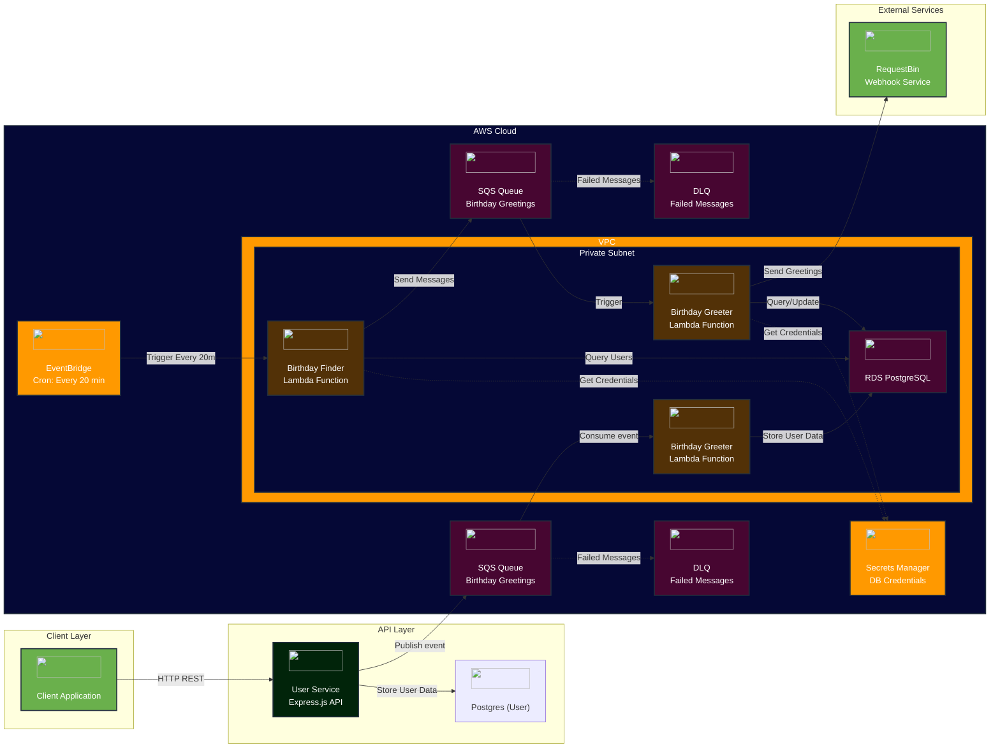
---

## Data Flow Diagram

### Birthday Greeting Flow

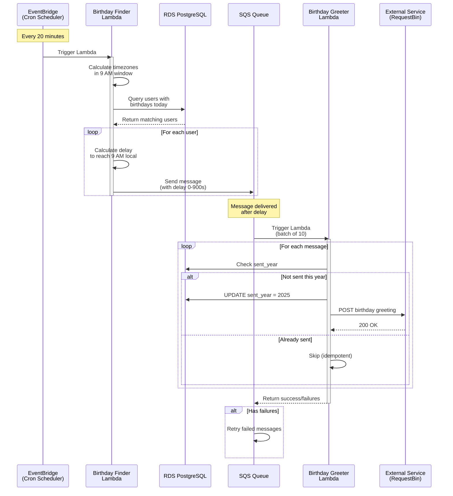

---

## User Service Architecture

### User Creation Flow

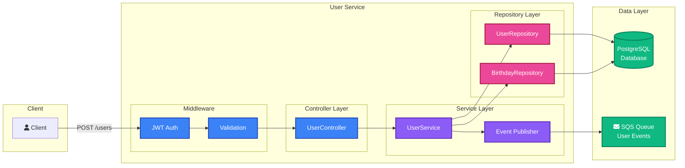

---

## Birthday Processing Flow

### Detailed Birthday Finder Logic

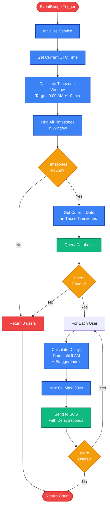

### Birthday Greeter Processing

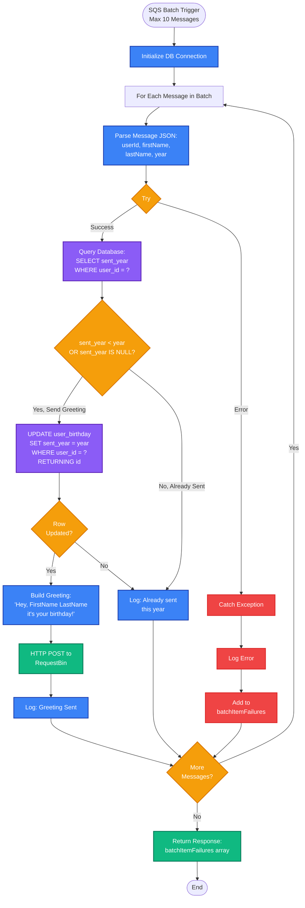

---

## Database Schema

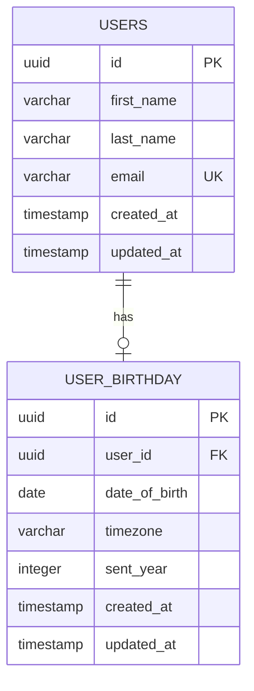

### Database Indexes

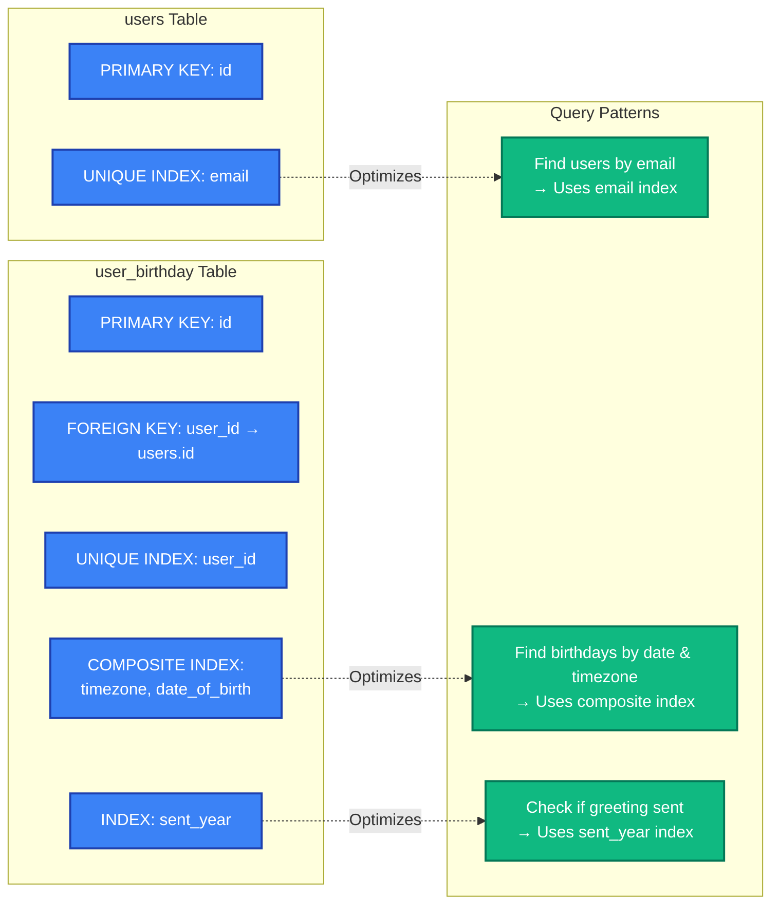

---

## Deployment Architecture

### AWS Infrastructure

## CDK Stack Relationships

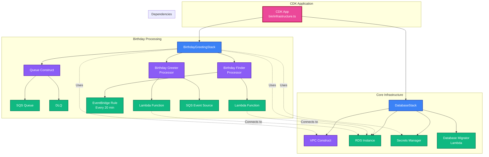

---

## System Scale and Performance

### Load Distribution Strategy

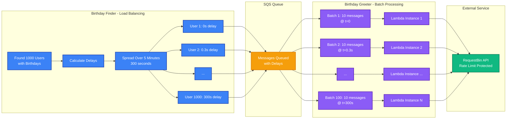

---

## Error Handling and Retry Strategy

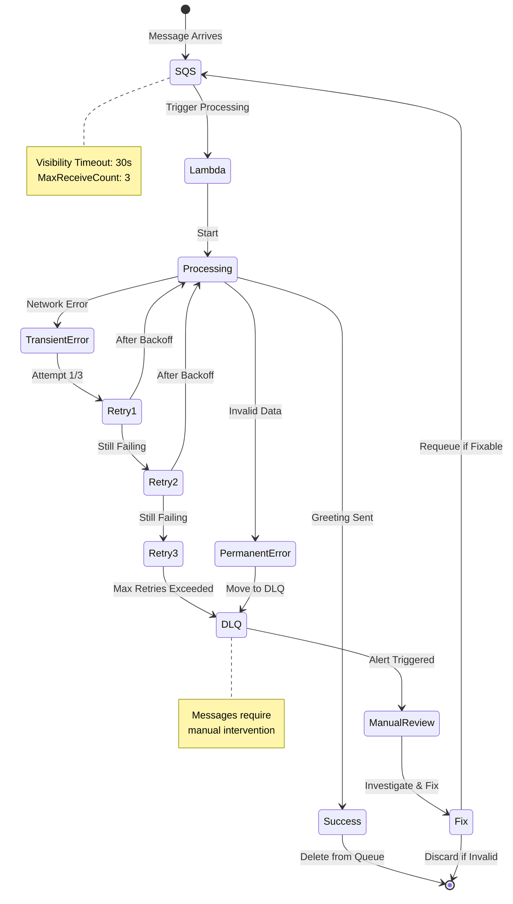

---

## Deployment Pipeline (Future State)

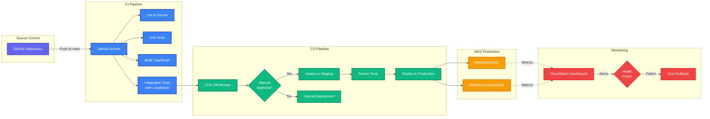
---

*For implementation details, see the main [README.md](./README.md)*
