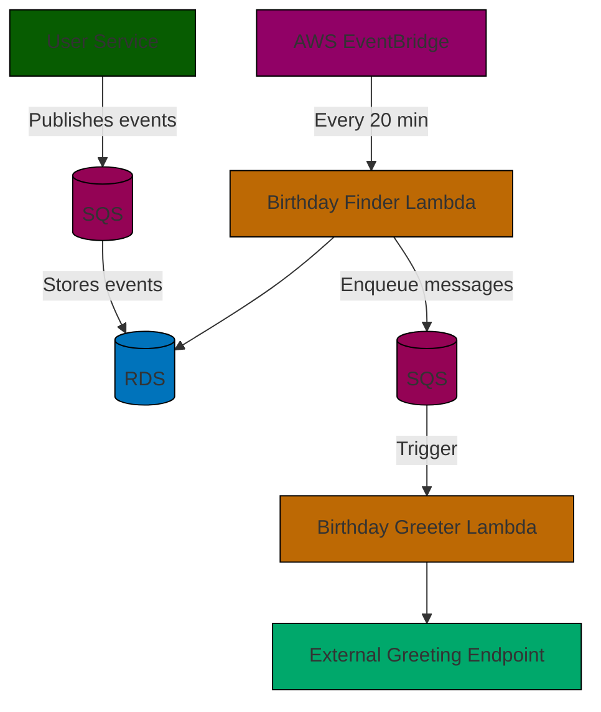

# 🎉 Erin Birthday Greeter System

_A serverless system that automatically sends birthday greetings to users at 9 AM in their local timezone._

---

## 🧭 Reviewer Quick Start

```bash
# 1️⃣ Clone the repo
git clone <repository-url> && cd erin-greeter

# 2️⃣ Start database
docker-compose up -d

# 3️⃣ Run the user service
cd user-service
npm install && npm run prepare
cp .env.example .env  # configure
npm start
```

User Service → http://localhost:3000  
Check health: `GET /healthz`

✅ That’s it!  
Optional: For AWS deployment, go to [`How to Run Application`](#how-to-run-application)

---

## 🧩 Table of Contents

1. [Architecture Overview](#architecture-overview)
2. [How to Run Application](#how-to-run-application)
3. [How to Run Tests](#how-to-run-tests)
4. [Assumptions & Key Decisions](#assumptions--key-decisions)
5. [Future Improvements](#future-improvements)
6. [Design Insights](#design-insights)
7. [Project Structure](#project-structure)

---

## 🏗️ Architecture Overview

### System Summary

A modular, event-driven, **serverless architecture** on AWS that:
- Stores user birthdays and timezones
- Finds users whose birthdays match “today” at 9 AM in their timezone
- Sends greetings through scheduled Lambdas via SQS queues



---

### 🔹 Components

| Component | Tech | Description |
|------------|------|-------------|
| **User Service** | Express.js + TypeScript | CRUD API, JWT auth, stores birthdays/timezones |
| **Birthday Finder Lambda** | Node.js | Finds birthdays due today (9 AM local time) |
| **Birthday Greeter Lambda** | Node.js | Sends greetings, ensures idempotency |
| **Infrastructure** | AWS CDK | VPC, RDS, SQS, EventBridge, Lambdas |
| **Database** | PostgreSQL + Prisma + Liquibase | Stores users & sent-year |
| **Testing** | Jest + Supertest + Localstack | Unit, integration, and local AWS simulation |

---

## ⚙️ How to Run Application

### Prerequisites

- Node.js ≥ 20
- Docker
- AWS CLI + AWS CDK (for cloud deployment)

### 🧪 Local Run (Quickest)

```bash
# Start DB
docker-compose up -d

# Run user service
cd user-service
npm install
cp .env.example .env
npm run prisma:generate
npm start
```

Access:  
`http://localhost:3000/healthz` → ✅ returns `"OK"`

---

### ☁️ Deploy to AWS (CDK)

```bash
cd infrastructure
npm install
aws configure
cdk bootstrap
cdk deploy --all
```

For rapid iteration:  
`cdk watch --all --hotswap-fallback --no-rollback`

---

### 🧰 Local AWS Simulation (Localstack)

```bash
docker-compose up -d
NODE_PATH=${PWD}/node_modules npx cdklocal bootstrap
NODE_PATH=${PWD}/node_modules npx cdklocal deploy -vvv --all --require-approval never
```

---

## 🧪 How to Run Tests

```bash
# Run all tests with coverage
npm test

# Watch mode
npm run dev
```

**Coverage:**
> Branches 72% • Functions 95% • Lines 96% • Statements 96%

Linting:
```bash
npm run lint
npm run lint:fix
```

---

## ⚖️ Assumptions & Key Decisions

| Area | Decision | Rationale |
|------|-----------|------------|
| **Timezone Handling** | IANA zones + Luxon | Accurate 9 AM delivery across DST |
| **Scheduling** | EventBridge every 20 min | Efficient 9 AM ±10 min window |
| **Load Balancing** | SQS delays (0–5 min spread) | Avoid spikes in traffic |
| **Idempotency** | `sent_year` column | Prevent duplicate greetings |
| **Testing** | Localstack + Docker | Fast local feedback loop |
| **Authentication** | JWT | Stateless & scalable |
| **Error Handling** | DLQ + Partial Batch Retry | Prevent blocking on failed jobs |

---

## 🚀 Future Improvements

- Personalized, multilingual greetings
- Email/SMS/Push delivery channels
- CloudWatch dashboards & alarms
- DynamoDB migration for scale
- Rate limiting & secrets rotation
- User self-service portal

---

## 💡 Design Insights

### Architecture Principles
- **Event-driven** → decoupled, async, scalable
- **Serverless-first** → zero idle cost, auto-scaling
- **Layered structure** → controller → service → repository → domain

### Error Handling
- 400 → Validation
- 422 → Business logic
- 404 → Not found
- 500 → Internal errors
- DLQ → Dead letters for failed greetings

### Database Schema
```sql
users (
  id UUID PRIMARY KEY,
  first_name VARCHAR,
  last_name VARCHAR,
  email VARCHAR UNIQUE
)

user_birthday (
  id UUID PRIMARY KEY,
  user_id UUID REFERENCES users(id),
  date_of_birth DATE,
  timezone VARCHAR,
  sent_year INTEGER
)
```

---

## 📁 Project Structure

```
erin-greeter/
├── user-service/
│   ├── src/
│   │   ├── controller/
│   │   ├── service/
│   │   ├── repository/
│   │   ├── domain/
│   │   └── di/
│   └── liquibase/
│
├── infrastructure/
│   ├── lib/
│   ├── lambda/
│   │   ├── birthday-finder-handler/
│   │   ├── birthday-greeter-handler/
│   │   └── database-migrater/
│
├── docker-compose.yml
└── README.md
```

---

## 🤝 Contributing

1. Fork
2. Create a feature branch
3. Commit with lint passing
4. Submit PR

---

## 📄 License

MIT License © 2025 — Built with ❤️ using TypeScript, Express & AWS CDK

---

### ✅ Reviewer Notes

- Clear modular separation between API, infra, and Lambdas.
- Fully runnable locally (Docker + Localstack).
- Clean architecture, strong test coverage, and high cohesion between services.
- Event-driven design enables future extensibility (email, SMS, etc.) with minimal change.
